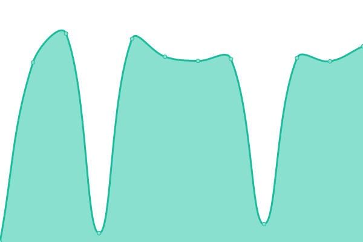
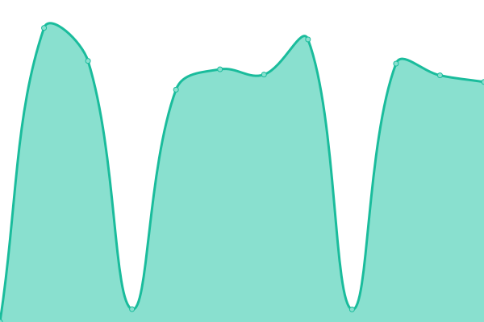

# [📈 Live Status](https://status.kushbhalodi.com): <!--live status--> **🟥 Complete outage**

This repository contains the open-source uptime monitor and status page for [Kush](https://kushbhalodi.com), powered by [Upptime](https://github.com/upptime/upptime).

With [Upptime](https://upptime.js.org), you can get your own unlimited and free uptime monitor and status page, powered entirely by a GitHub repository. We use [Issues](https://github.com/kush992/upptime/issues) as incident reports, [Actions](https://github.com/kush992/upptime/actions) as uptime monitors, and [Pages](https://status.kushbhalodi.com) for the status page.

<!--start: status pages-->
<!-- This summary is generated by Upptime (https://github.com/upptime/upptime) -->
<!-- Do not edit this manually, your changes will be overwritten -->
<!-- prettier-ignore -->
| URL | Status | History | Response Time | Uptime |
| --- | ------ | ------- | ------------- | ------ |
|  [KushBhalodi](https://kushbhalodi.com) | 🟥 Down | [kush-bhalodi.yml](https://github.com/kush992/up-time-kushbhalodi/commits/HEAD/history/kush-bhalodi.yml) | 

 1264ms
     
 | 

<a href="https://status.kushbhalodi.com/history/kush-bhalodi">99.83%</a>
    

|  [JobJourney](https://career.kushbhalodi.com) | 🟥 Down | [job-journey.yml](https://github.com/kush992/up-time-kushbhalodi/commits/HEAD/history/job-journey.yml) | 

 1004ms
     
 | 

<a href="https://status.kushbhalodi.com/history/job-journey">99.83%</a>
    

|  [Recipes KushBhalodi](https://recipe.kushbhalodi.com) | 🟥 Down | [recipes-kush-bhalodi.yml](https://github.com/kush992/up-time-kushbhalodi/commits/HEAD/history/recipes-kush-bhalodi.yml) | 

 2624ms
     
 | 

<a href="https://status.kushbhalodi.com/history/recipes-kush-bhalodi">99.83%</a>
    

|  [Grids KushBhalodi](https://grids.kushbhalodi.com) | 🟥 Down | [grids-kush-bhalodi.yml](https://github.com/kush992/up-time-kushbhalodi/commits/HEAD/history/grids-kush-bhalodi.yml) | 

 160ms
     
 | 

<a href="https://status.kushbhalodi.com/history/grids-kush-bhalodi">99.83%</a>
    

|  [Pierogi Villa](https://pierogi-villa.kushbhalodi.com) | 🟥 Down | [pierogi-villa.yml](https://github.com/kush992/up-time-kushbhalodi/commits/HEAD/history/pierogi-villa.yml) | 

 171ms
     
 | 

<a href="https://status.kushbhalodi.com/history/pierogi-villa">99.83%</a>
    

<!--end: status pages-->

[**Visit our status website →**](https://status.kushbhalodi.com)

## 📄 License

- Powered by: [Upptime](https://github.com/upptime/upptime)
- Code: [MIT](./LICENSE) © [Anand Chowdhary](https://anandchowdhary.com), supported by [Pabio](https://pabio.com)
- Data in the `./history` directory: [Open Database License](https://opendatacommons.org/licenses/odbl/1-0/)
